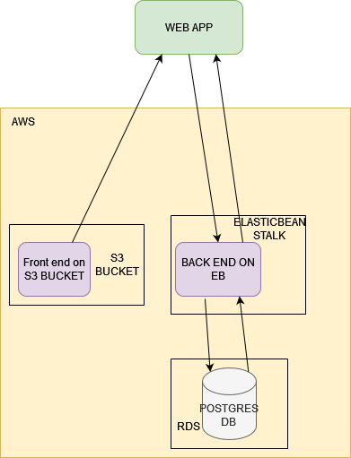
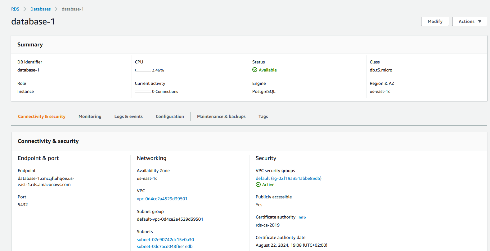
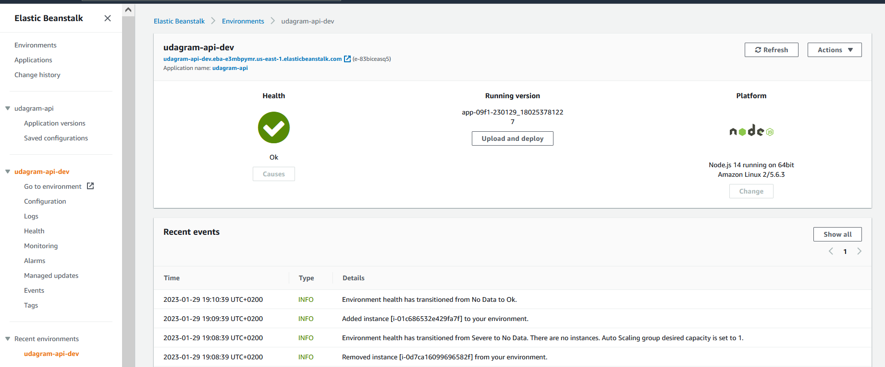
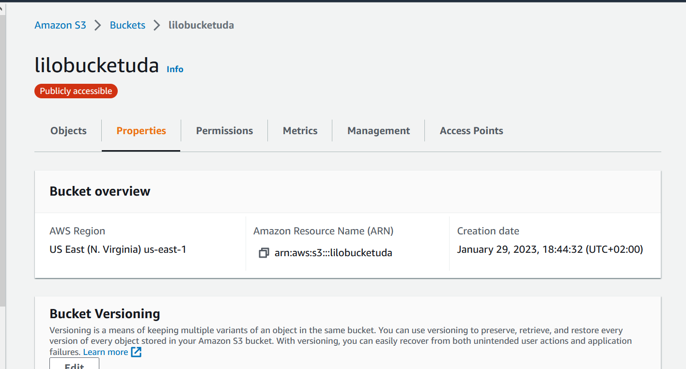
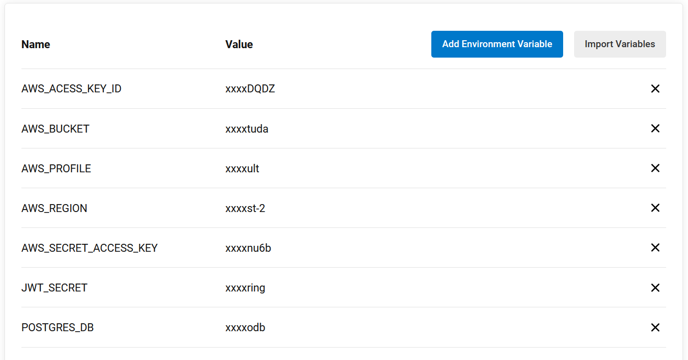
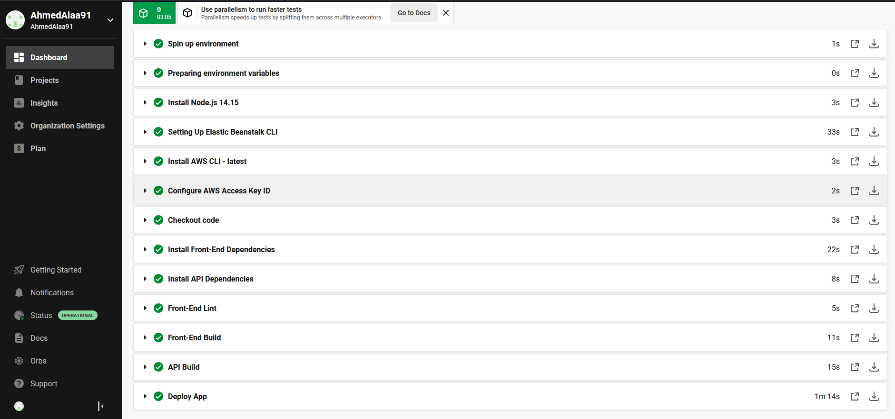

# Infrastructure Description

The application is separated into 2 apps ,  the  `udagram/udagram-frontend` for the frontend and the `udagram/udagram-api` for the backend

- The frontend app is on Amazon S3
- The Backend app is on Amazon Elastic Beanstalk
- The postgres Database is on Amazon RDS

## Infrastructure Diagram

### RDS

### Elastic Beanstalk

### S3

### Pipeline stages

